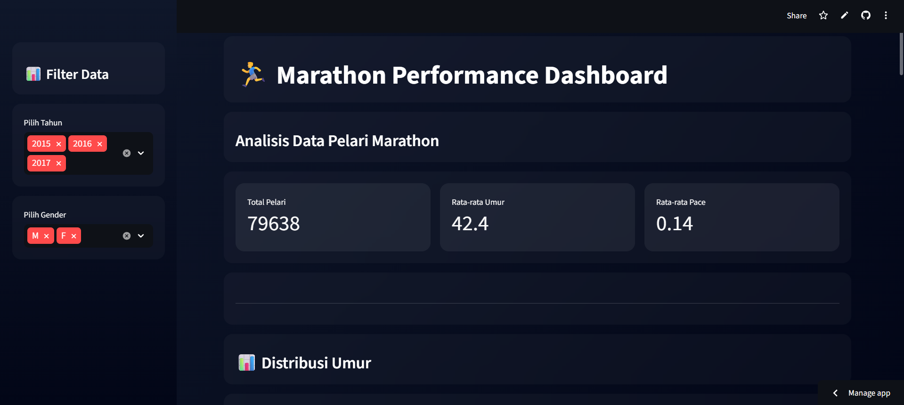
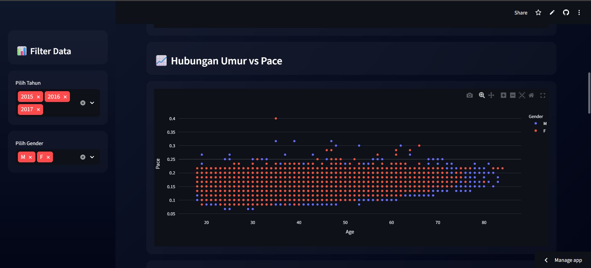
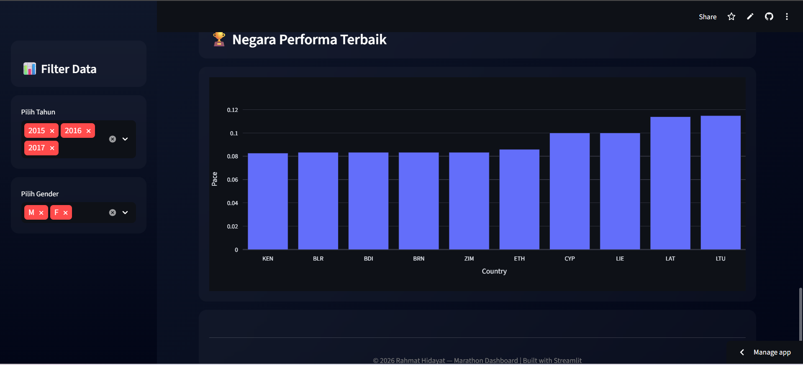

# 🏃 Marathon Boston Dashboard (2015–2017)

Dashboard interaktif berbasis Streamlit untuk analisis data Marathon Boston tahun 2015–2017.  
Project ini dibuat sebagai bagian dari tugas mata kuliah **Statistika** untuk mengeksplorasi data dan menyajikan insight dalam bentuk visualisasi interaktif.

---

## 🌐 Live Demo
Akses aplikasi di sini:  
https://marathonboston2015-2017.streamlit.app/

---

## 📸 Preview Dashboard

  
  
  

---

## 📌 Latar Belakang
Marathon Boston merupakan salah satu event lari paling prestisius di dunia. Dataset yang digunakan mencakup hasil lomba dari tahun 2015 hingga 2017.

Melalui dashboard ini dilakukan:
- eksplorasi data (EDA)
- analisis distribusi
- visualisasi performa pelari

---

## 🎯 Tujuan Project
- Mengaplikasikan konsep statistika dalam analisis data nyata  
- Melatih kemampuan eksplorasi dan visualisasi data  
- Membuat dashboard interaktif menggunakan Streamlit  
- Menyajikan insight secara informatif  

---

## 📊 Fitur Utama
- 📈 Visualisasi distribusi data (umur, waktu finish, dll)
- 🔍 Eksplorasi data marathon per tahun
- 📊 Grafik interaktif menggunakan Plotly
- 📋 Preview dataset

---

## 🛠️ Teknologi yang Digunakan
- Python  
- Streamlit  
- Pandas  
- Plotly
  
---

## 🌐 Deploy
Aplikasi ini dideploy menggunakan Streamlit Community Cloud.

---

## 📚 Insight Singkat
Beberapa analisis yang dapat dilakukan:
- Distribusi usia pelari  
- Performa berdasarkan kategori umur  
- Perbandingan hasil marathon tiap tahun  

---

## 👨‍🎓 Author
## 🔗 Connect with Me

---

## 📄 License
Project ini dibuat untuk keperluan pembelajaran.
